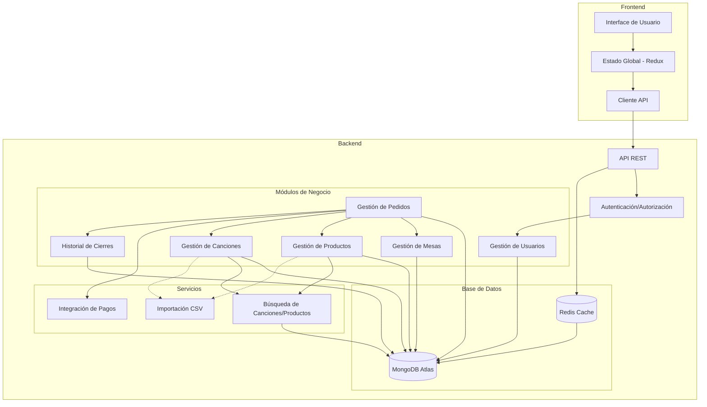

# Arquitectura del Sistema Karaoke Karibu

## Diagrama de Interacción entre Módulos

## Flujo de Datos Principal

1. **Autenticación y Gestión de Usuarios:**
   - Los usuarios se autentican a través del sistema de login
   - Se proporcionan roles diferentes (Administrador, Personal, Cliente)
   - Cada rol tiene permisos específicos

2. **Gestión de Mesas:**
   - Las mesas pueden estar disponibles, ocupadas, reservadas o en mantenimiento
   - Cada mesa está relacionada con pedidos activos

3. **Gestión de Canciones:**
   - Se puede buscar canciones por título, artista, género o idioma
   - Las canciones tienen información sobre letras y pistas de audio
   - Se pueden importar canciones masivamente vía CSV

4. **Gestión de Productos:**
   - Productos disponibles para venta (bebidas, comidas, snacks)
   - Cada producto tiene precio, categoría, disponibilidad y stock
   - Se pueden importar productos vía CSV

5. **Gestión de Pedidos:**
   - Los pedidos incluyen productos (consumibles) y solicitudes de canciones
   - Los pedidos están asociados a mesas específicas
   - Se registra quien atendió cada pedido

6. **Historial de Cierres:**
   - Al final del día se registra un resumen de operaciones
   - Se almacenan estadísticas de ventas y canciones más solicitadas
   - Permite visualizar el rendimiento histórico

## Interacciones Clave

- **Usuario → Mesa → Pedido:** Un usuario asigna una mesa a clientes y crea un pedido
- **Pedido → Productos + Canciones:** Un pedido puede contener tanto productos como solicitudes de canciones
- **Canciones + Atlas Search:** El sistema permite búsquedas avanzadas de canciones usando Atlas Search
- **Cierre diario → Pedidos:** Al final del día, se genera un reporte basado en los pedidos completados
